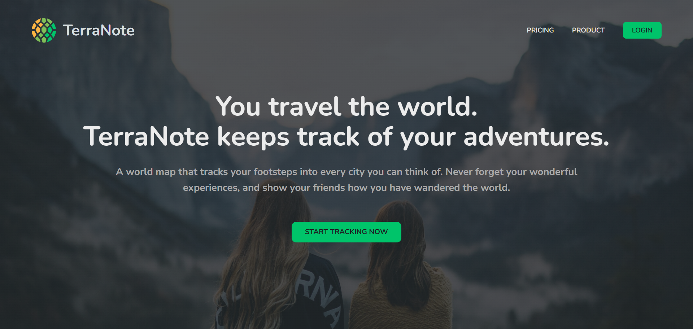
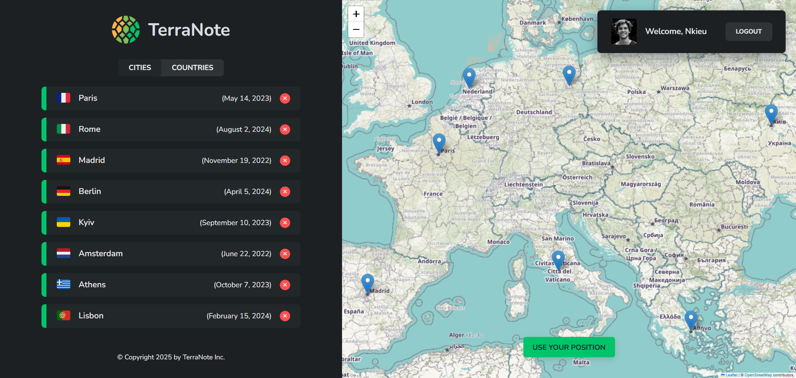
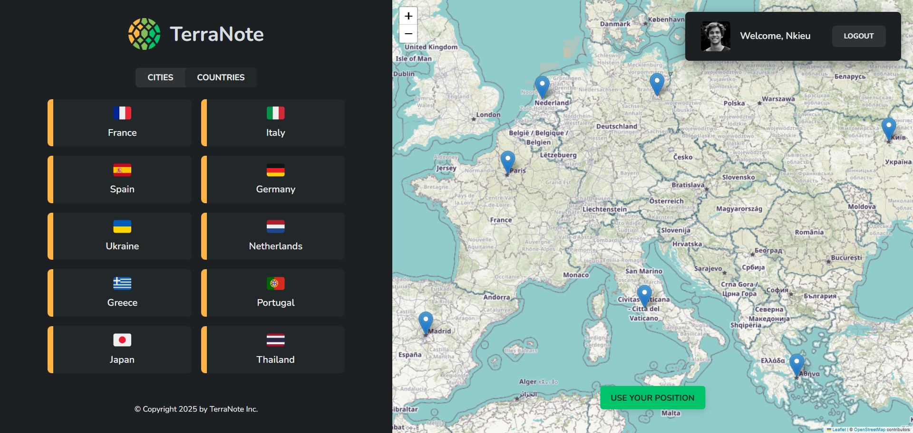

# 🌍 TerraNote App

TerraNote is a world travel journal app built with React. It allows you to record your journeys by adding cities to an interactive map, attaching notes, and viewing a country-based summary of your travels.

---

## 🌐 Live Demo

👉 [Try the live Application](https://nkieu-terranote-app.vercel.app/)

---

## 📸 Screenshots





---

## ✨ Key Features

- 🗺️ **Interactive Map UI** – Add cities by clicking on the map, powered by Leaflet and `react-leaflet`.
- 📍 **Geolocation Support** – Use your current location as a starting point.
- 🧾 **Add Notes** – Store your travel memories with notes, dates, and country flag emojis.
- 🌐 **Country Overview** – See a breakdown of cities by country with unique flag icons.
- 🔐 **Authentication (Mock)** – Simple login/logout system using fake credentials.
- 🛡️ **Protected Routes** – Only authenticated users can access app features.
- 🧭 **Dynamic & Nested Routing** – Navigate with meaningful routes like `/app/cities/:id`.
- 💾 **Mock Backend (json-server)** – Simulates full REST API behavior for city data.

---

## 🧠 Learning Objectives

This app reinforces key React concepts:

### ✅ React Router

- Declarative routing with `<Routes>`, `<Navigate>`, and nested layouts.
- Route protection via a `ProtectedRoute` wrapper.
- URL parameters & query strings using `useParams` and `useSearchParams`.

### ✅ State Management with Context API + useReducer

- Global state handling for **authentication** and **cities**.
- Clean separation of actions (loading, created, deleted, rejected) with a reducer pattern.
- Optimized performance using `useCallback` for dispatch functions.

### ✅ Custom Hooks

- useCities, useAuth, `useGeolocation`, and `useUrlPosition` abstract logic cleanly from components.
- Promotes reusability and separation of concerns.

### ✅ Component Design

- Reusable, modular components with scoped CSS Modules.
- `Lazy-loading` and `Suspense` for route-based code-splitting.

### ✅ External APIs & Libraries

- Map interaction with Leaflet + React Leaflet.
- Reverse geocoding integration via BigDataCloud API.
- Emoji polyfills for consistent country flag display.

---

## 🛠️ Technology Stack

| Technology             | Description                                    |
| ---------------------- | ---------------------------------------------- |
| **JavaScript**         | Modern ES6+ features                           |
| **React**              | JavaScript UI library (v19.1)                  |
| **React Router**       | Routing, route protection, dynamic paths       |
| **Vite**               | Modern build tool and dev server               |
| **Leaflet**            | An open-source JavaScript library for maps     |
| **react-leaflet**      | React components for Leaflet maps              |
| **react-datePicker**   | UI library for selecting dates                 |
| **json-server**        | Mock REST API for local development            |
| **CSS Modules**        | Scoped styling for UI components               |

---

## 🚀 Installation & Setup

1. **Clone the repository**

```bash
git clone https://github.com/nkieu-config/terranote-app-project.git
```

2. **Install dependencies**

```bash
npm install
```

3. **Start the development server**

```bash
npm run dev
```

4. **Start the mock API server**

```bash
npm run server
```

⚠️ Ensure `json-server` runs on `http://localhost:8000` as the app uses that for fetching and updating city data.

---

## 📚 Course Credit

This project was built as part of **[The Ultimate React Course 2025](https://www.udemy.com/course/the-ultimate-react-course/)** by [Jonas Schmedtmann](https://codingheroes.io/)

---

## 📃 License

This is a personal learning project and not intended for commercial or production use.
