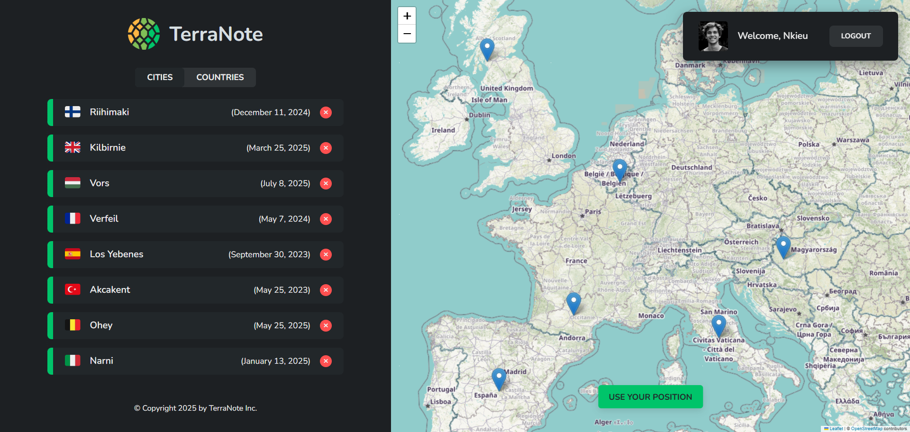

# 🌍 TerraNote App

TerraNote is a world travel journal app built with React. It helps you keep track of cities you've visited by pinning them on an interactive map, writing notes, and organizing your adventures by countries.

### 🌐 Live Demo

👉 [Try the live Application!](https://nkieu-terranote-app.vercel.app/)

---

## 📸 Screenshots




---

## ✨ Features

- 🗺️ **Interactive World Map**: View and click to mark visited cities using Leaflet maps.
- 📍 **Geolocation Support**: Automatically detect and zoom to your current location.
- 🧾 **Travel Notes**: Add personal notes, travel date, and emoji flags for each city.
- 🌐 **Country Summary**: Group visited cities by country with flag emoji support.
- 🔒 **Fake Authentication**: Login/logout with mock credentials.
- 🔐 **Protected Routes**: Only authenticated users can access the app dashboard.
- ⚙️ **Dynamic Routing**: View individual city details through route parameters (`/cities/:id`).
- 💾 **Local API**: Uses `json-server` as a mock backend to store data persistently during development.

---

## 🧠 Learning Goals

This app was created to deeply reinforce advanced React concepts, such as:

- **React Router v7**:
  - Nested and dynamic routes
  - Route protection (`ProtectedRoute`)
  - Programmatic navigation with `useNavigate`
- **React Context API + useReducer**:
  - Centralized global state for authentication and cities
  - Optimized state updates (loading, error, CRUD operations)
  - Memoizing context function using `useCallback`
- **Custom Hooks**:
  - `useCities`, `useAuth`, `useGeolocation`, and `useUrlPosition`
- **Component Composition**:
  - Well-structured reusable components
- **React + Leaflet Integration**:
  - Pin placement using coordinates
  - Map zoom and dynamic center movement
- **Form Management**:
  - Controlled components with validations and loading state
  - Geocoding integration using `https://api.bigdatacloud.net`

---

## 🛠️ Technology Stack & Library

| Tech              | Description                              |
| ----------------- | ---------------------------------------- |
| **React**         | JavaScript UI library (v19.1.0)          |
| **React Router**  | Client-side routing (v7.6.3)             |
| **React Context** | Shared global state (cities, auth)       |
| **Vite**          | Lightning-fast dev server (v7.x)         |
| **Leaflet**       | Open-source map rendering                |
| **react-leaflet** | React bindings for Leaflet maps          |
| **Datepicker**    | Date input UI                            |
| **json-server**   | Mock REST API for development            |
| **CSS Modules**   | Modular and scoped styling for each view |

---

## 🚀 Installation & Setup

1. **Clone the repository**

```bash
git clone https://github.com/nkieu-config/terranote-app-project.git
```

2. **Install dependencies**

```bash
npm install
```

3. **Start the development server**

```bash
npm run dev
```

4. **Start the mock API server**

```bash
npm run server
```

⚠️ The app fetches data from `http://localhost:8000/cities`. Ensure `json-server` is installed and available globally or via project dependencies.

---

## 📚 Course Credit

This project was built as part of **[The Ultimate React Course 2025](https://www.udemy.com/course/the-ultimate-react-course/)** by [Jonas Schmedtmann](https://codingheroes.io/)

---

## 📃 License

This is a personal learning project and not intended for commercial or production use.
